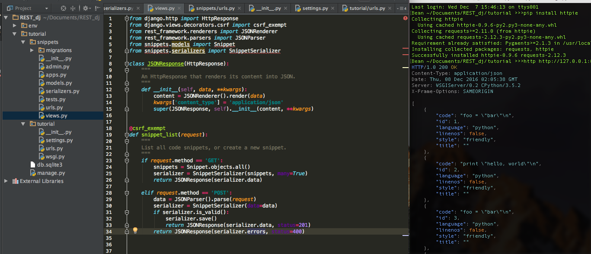
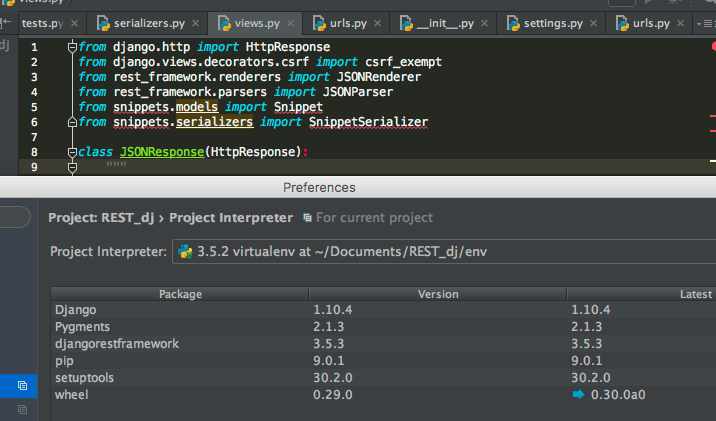

# Unresolved reference warning on Pycharm during Django REST framework

When I study about Django REST framework with tutorial, I used Pycharm to test it.

but There was 'Unresolved reference <###>~~' comment on import.

Pycharm interpreter setting wasn't problem.

I don't know why it shows me warning yet...

I found similar case but it's not solution to solve this problem.
[link to stackoverflow](http://stackoverflow.com/questions/11725519/pycharm-shows-unresolved-references-error-for-valid-code)

