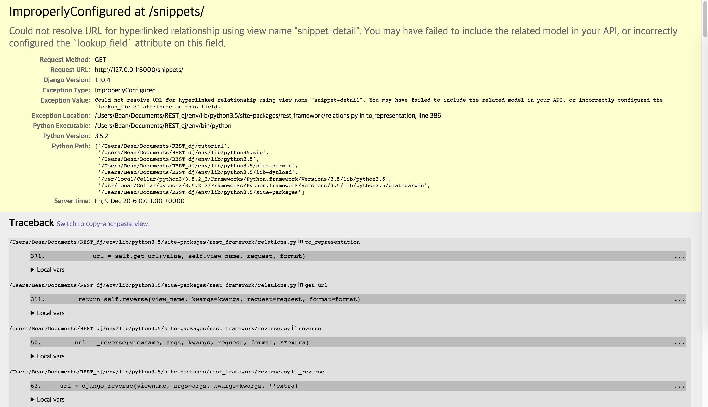
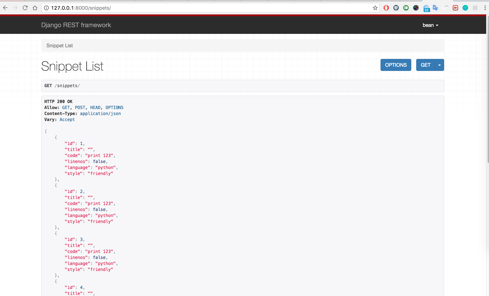

#Error occured dDuring follow Django REST framework tutorials

I tried to use <http://127.0.0.1:8000/snippets/> but It doesn't work.

I rewrited tutorial steps, but It doesn't work yet.

so, I searched error code and It works!

follow this tips>> [link](https://github.com/tomchristie/django-rest-framework/issues/815)

