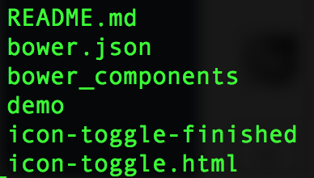

#Polymer 느껴보기

* [slide link](http://www.slideshare.net/inureyes/html5-web-components-54507480)
* [slide link](http://www.slideshare.net/inureyes/googles-prpl-web-development-pattern)
* [slide link](http://www.slideshare.net/netil/polymer-37533613?next_slideshow=1)

## development configuration setting
1. download tutorial sourcode
	 * [link](https://github.com/googlecodelabs/polymer-first-elements/releases/download/v1.0/polymer-first-elements.zip)

2. expand the ZIP file and check
 

3. Install Polymer CLI

3-1. Install 4.x LTS of Node.js

3-2. Install Git

3-3. Install the latest version of Bower
	 > sudo npm install -g bower

3-4. Install Polymer CLI
	 > sudo npm install -g polymer-cli

## Run the demo
1. Run polymer serve
> Polymmer serve

2. Open the page in brower
> localhost:8080/components/icon-toggle-demo/

