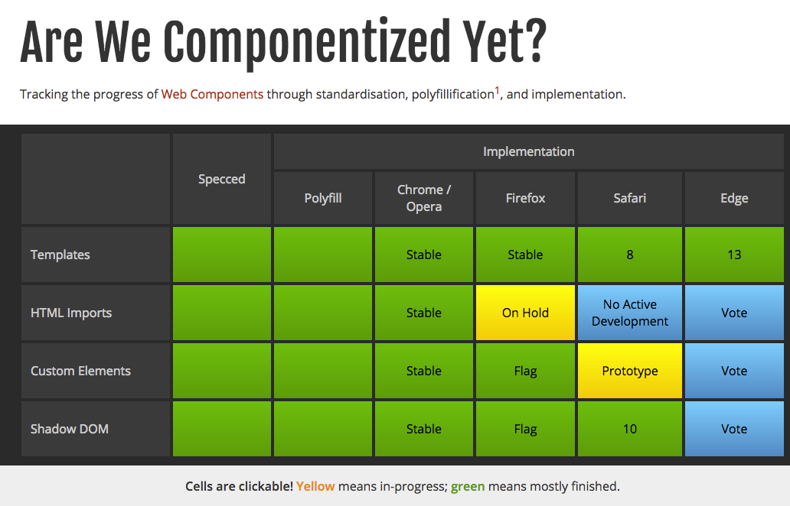
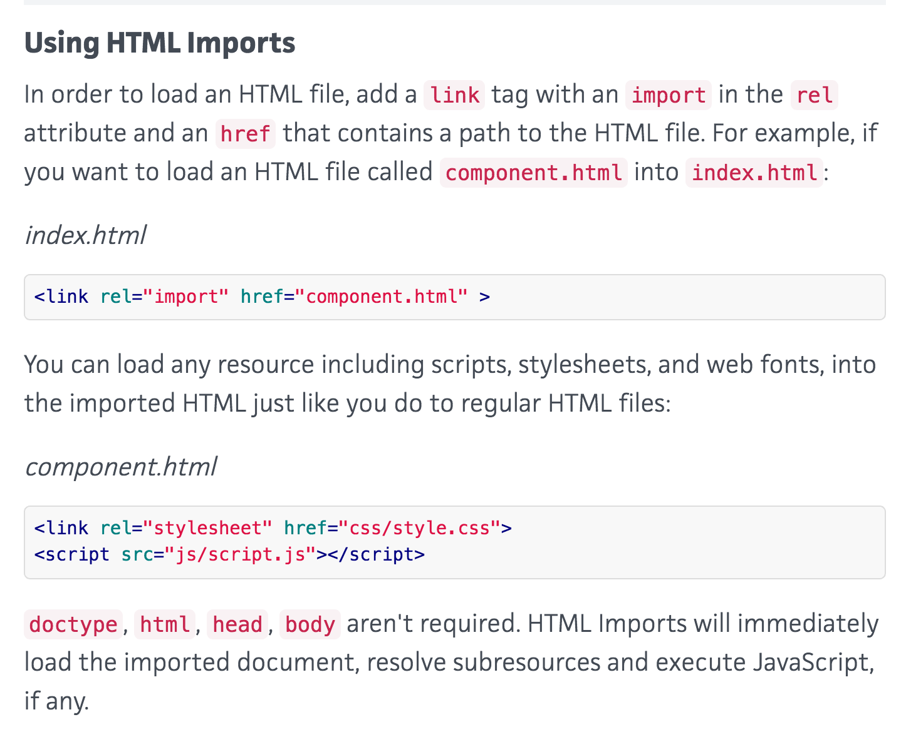

#polymer works well on Chrome but doesn't works on Safari

I wrote a code about webcomponents.js in my file like this
```
<link rel="import" href="bower_components/webcomponentsjs/webcomponents-lite.min.js">
```

It works on Chrome. but It doesn't work on Safari.
because of they doesn't not support 'HTML import'
reference link : [reference](http://jonrimmer.github.io/are-we-componentized-yet/)



so I changed my code like this
```
<script src="bower_components/webcomponentsjs/webcomponents-lite.min.js"></script>
```

reference link : [reference](http://webcomponents.org/articles/introduction-to-html-imports/)

